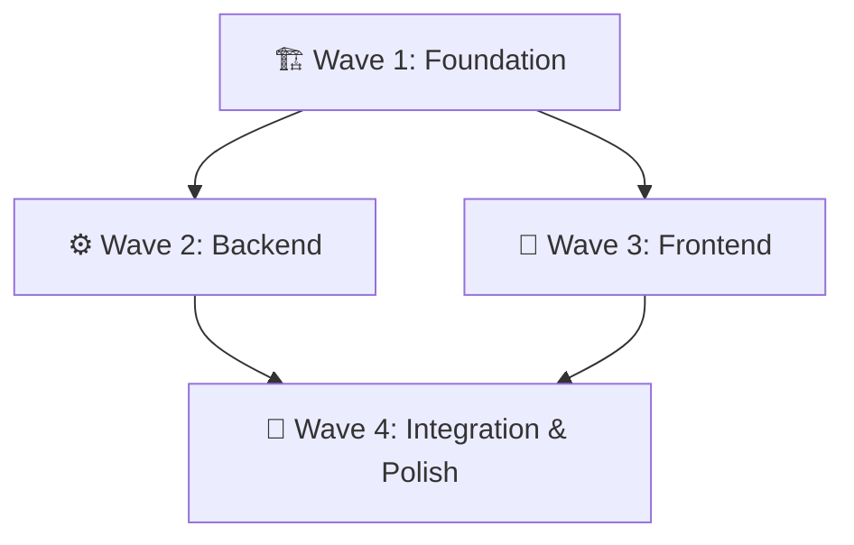

# 🤖 Multi-Agent Execution Strategy — WorkNest

## Tổng Quan

Project WorkNest có **~60+ files**, **8 modules**, **28 API endpoints** — quá lớn để làm tuần tự không có kế hoạch rõ ràng. Chiến lược dưới đây phân chia công việc theo **5 vai trò chuyên biệt (Agent Roles)**, thực thi qua **4 đợt (Waves)** theo dependency graph.

---

## Kiến Trúc Phân Chia Agent



### 5 Agent Roles

| Agent | Vai trò | Phạm vi | Output |
|---|---|---|---|
| 🏗️ **Architect** | Setup project, config, design system | Config files, CSS, types | Foundation sẵn sàng cho tất cả agents khác |
| ⚙️ **Backend** | Data layer + tất cả API routes | `lib/*`, `app/api/**` | 28 API endpoints hoạt động, có seed data |
| 🧩 **Component** | Xây tất cả UI components tái sử dụng | `components/**` | 15 components với props interface rõ ràng |
| 📄 **Page** | Xây tất cả 8 pages/modules | `app/*/page.tsx` | 8 trang hoàn chỉnh, kết nối API |
| ✅ **QA/Polish** | Test, fix bugs, animation polish, deploy | All files | Website hoàn thiện, deploy thành công |

---

## Chi Tiết Từng Wave

### 🏗️ Wave 1: Foundation (Architect Agent)
> **Mục tiêu**: Thiết lập nền tảng mà tất cả phần khác phụ thuộc vào
> **Thời gian ước tính**: ~15 phút

```
Task 1.1: Project Init
├── package.json (dependencies)
├── next.config.ts
├── tsconfig.json
├── netlify.toml
├── .gitignore
└── public/favicon.svg

Task 1.2: Design System (globals.css)
├── CSS Variables (colors, typography, spacing, shadows, radius)
├── CSS Reset & Base styles
├── Layout classes (app-layout, sidebar, header, main-content)
├── Animation keyframes (7 animations)
├── Component base classes (btn, input, card, modal, badge, table, toast...)
├── Utility classes
└── prefers-reduced-motion media query

Task 1.3: TypeScript Types
└── lib/types.ts (User, Employee, LeaveRequest, Meeting, Task, Announcement, Comment)

Task 1.4: Root Layout Shell
└── app/layout.tsx (fonts, metadata, basic structure — placeholder cho Sidebar/Header)
```

**✅ Quality Gate**: `npm run type-check` passes, dev server starts, CSS renders correctly

---

### ⚙️ Wave 2A: Backend (Backend Agent)
> **Phụ thuộc**: Wave 1 hoàn thành (types.ts, package.json)
> **Thời gian ước tính**: ~25 phút

```
Task 2A.1: Core Data Layer
├── lib/store.ts (DataStore class: CRUD, search, paginate, filter)
├── lib/auth.ts (JWT sign/verify, password hash, token extract)
└── lib/seed.ts (5 users, 15 employees, 10 leave requests,
                  5 rooms, 8 meetings, 20 tasks, 6 announcements)

Task 2A.2: Auth API (3 endpoints)
├── app/api/auth/login/route.ts      — POST
├── app/api/auth/register/route.ts   — POST
└── app/api/auth/me/route.ts         — GET (Bearer token)

Task 2A.3: Employee API (5 endpoints)
├── app/api/employees/route.ts       — GET (search, filter, paginate), POST
└── app/api/employees/[id]/route.ts  — GET, PUT, DELETE

Task 2A.4: Leave API (6 endpoints)
├── app/api/leave/route.ts           — GET (filter), POST
├── app/api/leave/[id]/route.ts      — GET, PUT, DELETE
└── app/api/leave/[id]/approve/route.ts — PUT (approve/reject)

Task 2A.5: Meeting API (5 endpoints)
├── app/api/meetings/route.ts        — GET, POST
├── app/api/meetings/rooms/route.ts  — GET
└── app/api/meetings/[id]/route.ts   — GET, PUT, DELETE

Task 2A.6: Task API (4 endpoints)
├── app/api/tasks/route.ts           — GET, POST
└── app/api/tasks/[id]/route.ts      — GET, PUT, DELETE

Task 2A.7: Announcement API (5 endpoints)
├── app/api/announcements/route.ts              — GET, POST
├── app/api/announcements/[id]/route.ts         — GET, PUT, DELETE
└── app/api/announcements/[id]/comments/route.ts — POST

Task 2A.8: Utility API (2 endpoints)
├── app/api/dashboard/stats/route.ts — GET
└── app/api/seed/route.ts            — POST (reset data)
```

**✅ Quality Gate**: Tất cả 28 endpoints trả về đúng JSON response khi gọi bằng curl

---

### 🧩 Wave 2B: UI Components (Component Agent)
> **Phụ thuộc**: Wave 1 hoàn thành (globals.css, types.ts)
> **Có thể chạy SONG SONG với Wave 2A** — không phụ thuộc Backend

```
Task 2B.1: Core Components (sử dụng nhiều nhất)
├── components/ui/Button.tsx      — 5 variants, 3 sizes, loading state
├── components/ui/Input.tsx       — text/email/password, validation error
├── components/ui/Modal.tsx       — overlay, scaleIn, focus trap, Escape close
├── components/ui/Badge.tsx       — 5 color variants, pulse option
└── components/ui/Card.tsx        — elevated surface, hover lift

Task 2B.2: Data Components
├── components/ui/DataTable.tsx   — sortable columns, hover, loading skeleton
├── components/ui/Pagination.tsx  — page numbers, prev/next
├── components/ui/SearchBar.tsx   — icon, expand animation, debounce
└── components/ui/Select.tsx      — custom dropdown, slideDown animation

Task 2B.3: Feedback Components
├── components/ui/Toast.tsx       — slideInRight, auto-dismiss, progress bar
├── components/ui/ConfirmDialog.tsx — extends Modal, warning icon
└── components/ui/EmptyState.tsx  — icon + message + action button

Task 2B.4: Specialized Components
├── components/ui/Avatar.tsx      — initials-based, color hash, online dot
├── components/ui/StatCard.tsx    — gradient accent, countUp animation
└── components/ui/DatePicker.tsx  — calendar popup, range selection
```

**✅ Quality Gate**: Tất cả components render không error, TypeScript strict passes

---

### 🎨 Wave 3: Pages (Page Agent)
> **Phụ thuộc**: Wave 2A + Wave 2B đều hoàn thành
> **Thời gian ước tính**: ~40 phút

```
Task 3.1: Layout Components (cần trước tất cả pages)
├── components/layout/Sidebar.tsx    — navigation, active state, user info
├── components/layout/Header.tsx     — breadcrumb, search, user dropdown
├── components/layout/AuthGuard.tsx  — JWT check, redirect, loading skeleton
└── app/layout.tsx (update)          — integrate Sidebar + Header + AuthGuard

Task 3.2: Auth Pages
├── app/login/page.tsx     — email/password form, error handling, demo accounts
└── app/register/page.tsx  — multi-field form, password strength, validation

Task 3.3: Dashboard
└── app/page.tsx — stat cards, recent activity, quick actions, upcoming meetings

Task 3.4: Employee Module
└── app/employees/page.tsx — search, filter, table, CRUD modals, role-based actions

Task 3.5: Leave Module
└── app/leave/page.tsx — tabs, balance cards, request form, approval workflow

Task 3.6: Meeting Module
└── app/meetings/page.tsx — room cards, booking modal, time slots, my bookings

Task 3.7: Task Module
└── app/tasks/page.tsx — Kanban columns, task cards, status change, CRUD modal

Task 3.8: Announcement Module
└── app/announcements/page.tsx — feed, category filter, comments, pin/unpin

Task 3.9: Settings
└── app/settings/page.tsx — profile edit, change password, toggle switches
```

**✅ Quality Gate**: Navigate qua tất cả pages, auth flow hoàn chỉnh, CRUD operations hoạt động

---

### ✅ Wave 4: QA & Polish (QA Agent)
> **Phụ thuộc**: Wave 3 hoàn thành
> **Thời gian ước tính**: ~15 phút

```
Task 4.1: Testability Audit
├── Verify tất cả interactive elements có data-testid
├── Verify semantic HTML (roles, aria-labels, headings)
├── Verify form elements có proper name/id
├── Verify API response consistency (JSON structure)
└── Fix bất kỳ missing attributes nào

Task 4.2: Animation Polish
├── Review entrance animations trên mỗi page
├── Verify staggered children timing
├── Test prefers-reduced-motion
├── Optimize performance (only transform/opacity)
└── Smooth page transition effects

Task 4.3: Build & Deploy
├── npm run build (fix any errors)
├── npm run type-check
├── npm run lint (fix warnings)
├── Test trên browser thực tế
└── Netlify deploy instructions

Task 4.4: Smoke Test (Browser)
├── Login với demo account
├── Navigate tất cả pages
├── Thực hiện 1 CRUD operation mỗi module
├── Verify animations render
└── Screenshot results
```

**✅ Quality Gate**: Build thành công, tất cả pages load, API hoạt động, animations smooth

---

## Dependency Graph Chi Tiết

```mermaid
graph LR
    subgraph "Wave 1 — Foundation"
        A1["package.json\nnext.config.ts\ntsconfig.json"]
        A2["globals.css\n(Design System)"]
        A3["lib/types.ts"]
        A4["layout.tsx shell"]
    end

    subgraph "Wave 2A — Backend"
        B1["store.ts\nauth.ts\nseed.ts"]
        B2["Auth API\n3 endpoints"]
        B3["Employee API\n5 endpoints"]
        B4["Leave API\n6 endpoints"]
        B5["Meeting API\n5 endpoints"]
        B6["Task API\n4 endpoints"]
        B7["Announcement API\n5 endpoints"]
        B8["Utility API\n2 endpoints"]
    end

    subgraph "Wave 2B — Components"
        C1["Core: Button\nInput, Modal\nBadge, Card"]
        C2["Data: Table\nPagination\nSearch, Select"]
        C3["Feedback: Toast\nConfirm, Empty"]
        C4["Special: Avatar\nStatCard\nDatePicker"]
    end

    subgraph "Wave 3 — Pages"
        D1["Layout: Sidebar\nHeader, AuthGuard"]
        D2["Login + Register"]
        D3["Dashboard"]
        D4["Employees"]
        D5["Leave"]
        D6["Meetings"]
        D7["Tasks"]
        D8["Announcements"]
        D9["Settings"]
    end

    subgraph "Wave 4 — QA"
        E1["Testability Audit"]
        E2["Animation Polish"]
        E3["Build & Deploy"]
    end

    A1 --> A2 --> A3 --> A4
    A3 --> B1 --> B2 --> B3 --> B4 --> B5 --> B6 --> B7 --> B8
    A2 --> C1 --> C2 --> C3 --> C4
    B8 --> D1
    C4 --> D1
    D1 --> D2 --> D3 --> D4 --> D5 --> D6 --> D7 --> D8 --> D9
    D9 --> E1 --> E2 --> E3
```



---

## Chiến Lược Thực Thi Đề Xuất

### Cách tiếp cận: Sequential Waves với `/goal`

Vì môi trường hiện tại hoạt động tốt nhất với **1 agent chính chạy tuần tự**, tôi đề xuất:

> **Dùng lệnh `/goal`** — cho phép agent chạy liên tục, không dừng, cho đến khi hoàn thành toàn bộ project.

#### Lợi ích của `/goal`:
- ✅ Agent sẽ **không dừng giữa chừng** để hỏi — chạy xuyên suốt
- ✅ Tự động **track progress** qua task.md
- ✅ Xử lý errors và **self-correct** mà không cần bạn can thiệp
- ✅ Phù hợp cho task lớn cần **nhiều thời gian liên tục**

#### Prompt `/goal` đề xuất:
```
/goal Implement toàn bộ WorkNest project theo implementation_plan.md. 
Thực hiện tuần tự 4 Waves theo multi_agent_strategy.md.
Sau mỗi Wave chạy quality gate check.
Cuối cùng build thành công và verify trên browser.
```

### Ước Tính Thời Gian

| Wave | Tasks | Thời gian ước tính |
|---|---|---|
| Wave 1: Foundation | 4 tasks | ~15 phút |
| Wave 2A: Backend | 8 tasks | ~25 phút |
| Wave 2B: Components | 4 tasks | ~20 phút |
| Wave 3: Pages | 9 tasks | ~40 phút |
| Wave 4: QA & Polish | 4 tasks | ~15 phút |
| **Tổng** | **29 tasks** | **~2 giờ** |

---

## Câu Hỏi Trước Khi Bắt Đầu

> [!IMPORTANT]
> Trước khi tôi bắt đầu implement, bạn cần trả lời 3 câu hỏi từ implementation plan:
> 1. **Workspace**: Tạo tại `project-site` đúng chứ?
> 2. **Ngôn ngữ UI**: Tiếng Anh hay Việt?
> 3. **Playwright framework**: Setup luôn hay không?
>
> Sau khi trả lời, bạn chỉ cần gõ **"Bắt đầu"** hoặc dùng `/goal` command — tôi sẽ chạy xuyên suốt.
